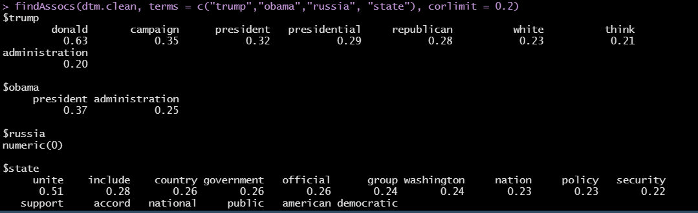
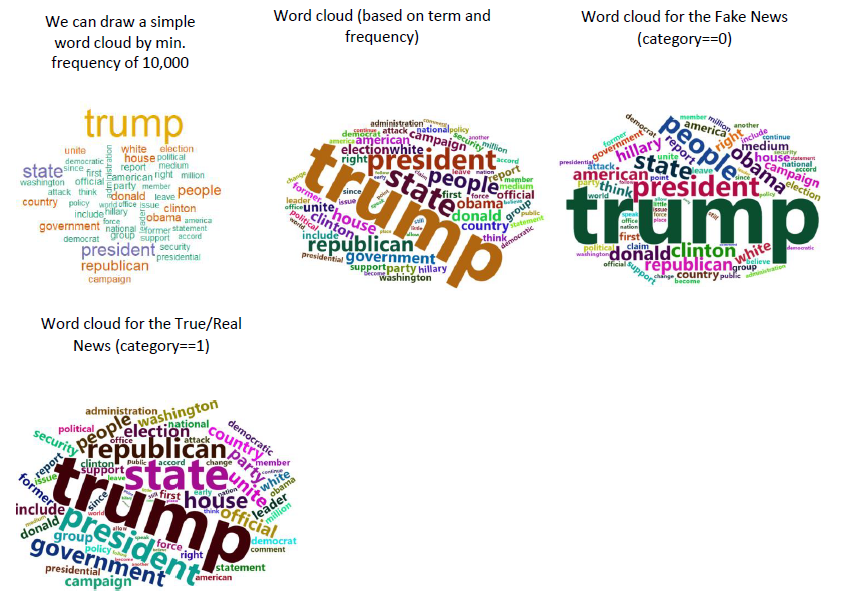
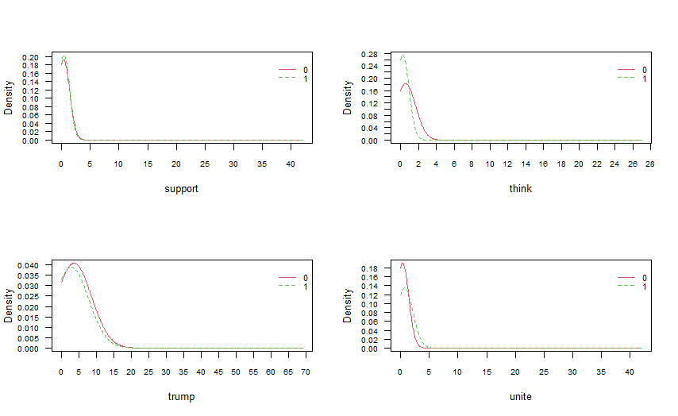
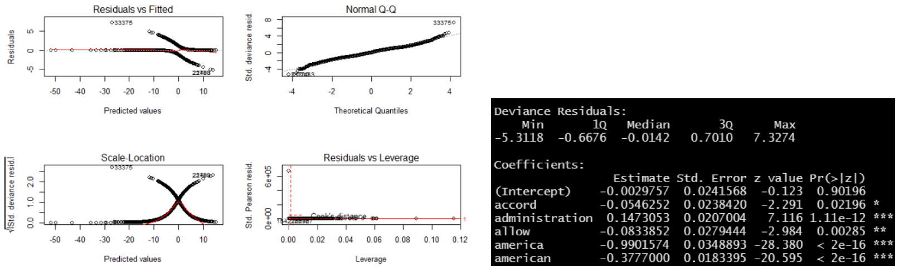
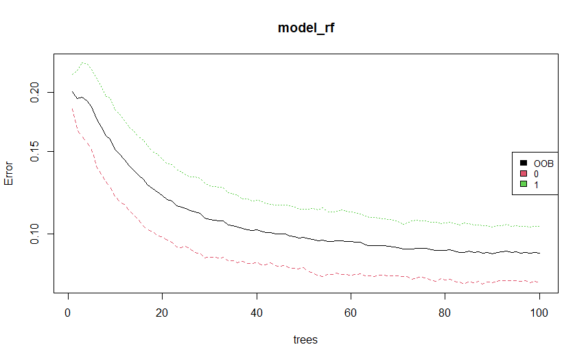
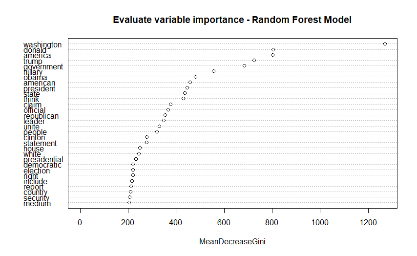

# Fake-News
Fake News analysis in R markdown

# Code:
https://github.com/trajceskijovan/Fake-News/blob/main/Fake%20News.R

# Presentation:
https://github.com/trajceskijovan/Fake-News/blob/main/Presentation.pdf

# EDA:

1. Top Words by "Title" (only words over 5 characters allowed):

2. Merge fake and true news and create a plot over time:

- Fake news are more frequent in 2016, 2017 and first half of 2018.
- In Q4 2018 fake and true news are balanced

3. Are datasets balanced?

The merged dataset is Balanced - this will make it easier for prediction.

4. There are 631 missing values in the “Text” column. They are removed.

5. News count by each Subject, and, Subject by category plots:

# Pre-processing and data cleanup:

> Create a corpus (type of object expected by "tm" library)
> 
> Text to lower case
> 
> Remove numbers
> 
> Remove Punctuations
> 
> Remove Stopwords
> 
> Remove specific words (example: we should remove the name of the newspaper –“Reuters”-its on every news)
> 
> Remove Whitespace
> 
> I have decided not to do “stem words” as it tweaks and cuts the words and they might lose their meaning
> 
> Remove other punctuation issues (example: "[[:punct:]]" )
> 
> Lemmatization
> 
> Create Document Term Matrix with control list (example: “wordLengths=c(5, 20)”)
> 
> I enforced lower and upper limit to the length of the words included (between 5 and 20 characters) to speed up data processing and eliminate noise
> 
> After that, I removed all terms whose sparsity is greater than the threshold. Sparsity dropped from 100% to 77% and term length dropped from 20 to 14 (example: “sparse = 0.85”)
> 
> Convert DTM to matrix to DataFrame

# Post-processing analysis:

Return all terms that occur more than 20,000 times in the entire corpus:

findFreqTerms(dtm.clean,lowfreq=20000)

 [1] "american"   "campaign"   "clinton"    "country"    "donald"     "election"   "government" "house"     
 [9] "include"    "obama"      "official"   "party"      "people"     "president"  "report"     "republican"
[17] "right"      "state"      "trump"      "unite"      "white"     

Correlation limit inspection and associations among: “Trump”,” Obama”, “Russia”, “State”:

WordClouds:

# Modelling, Prediction, Performance:

1. Naive Bayes Model

2. Logistic Regression Model

3. Random Forest Model

