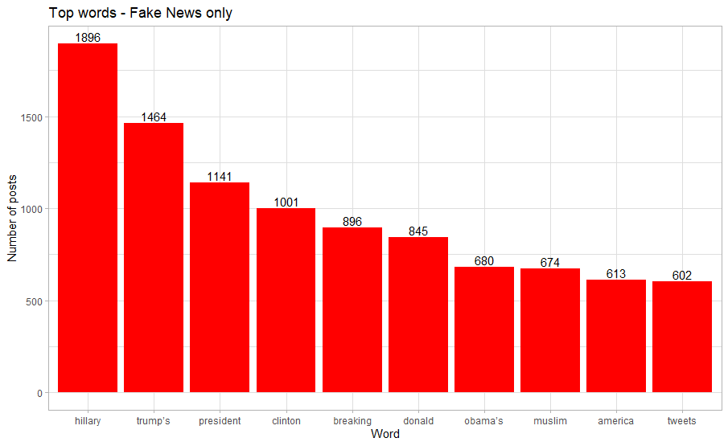
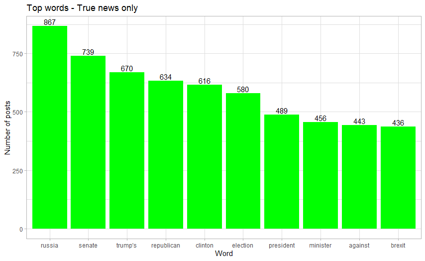
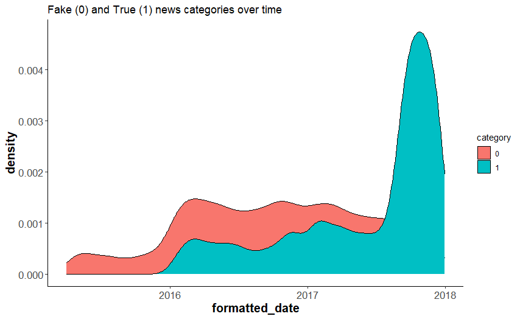
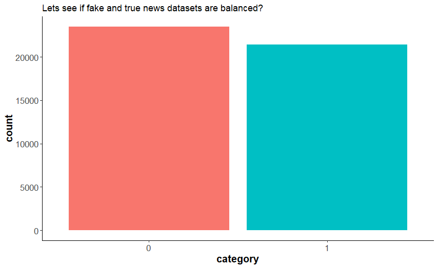
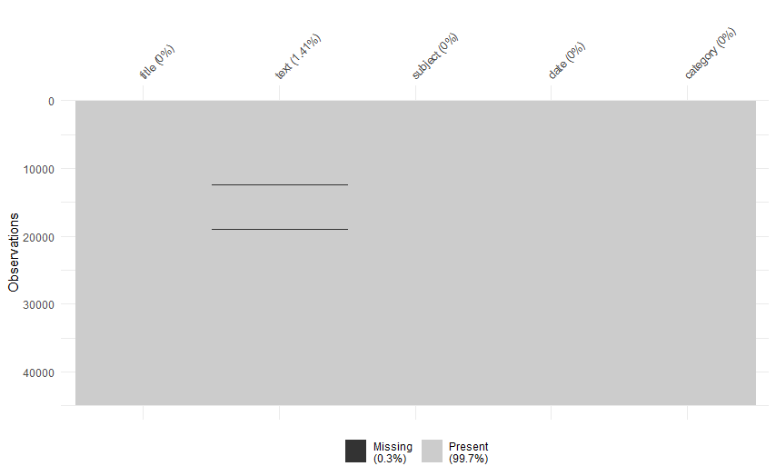
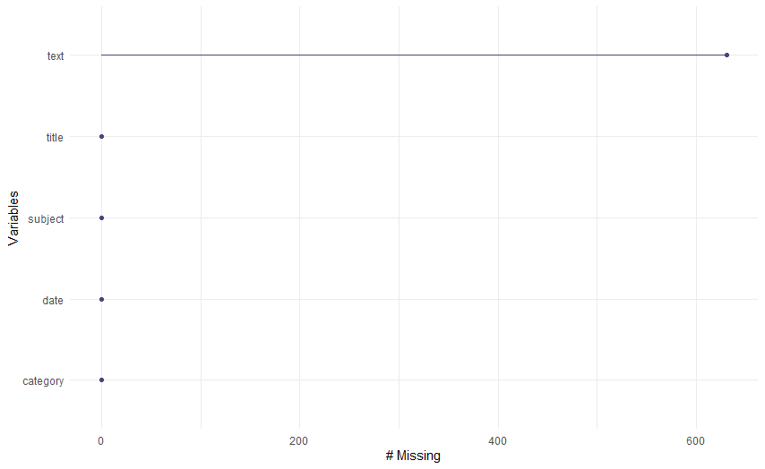
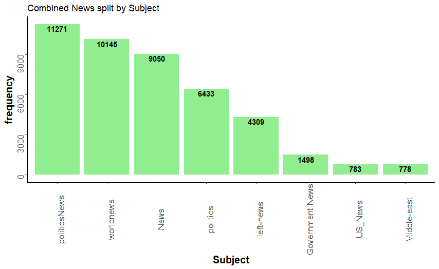
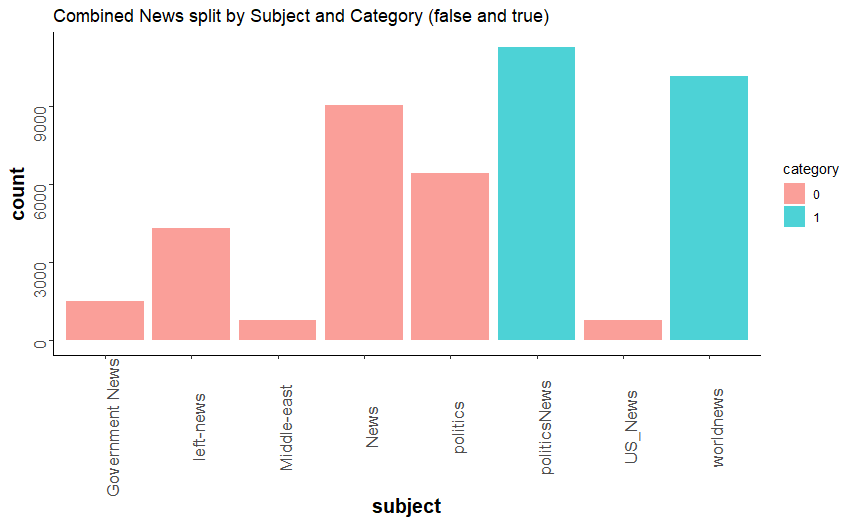

# Fake-News
Fake News analysis in R markdown

# Code:
https://github.com/trajceskijovan/Fake-News/blob/main/Fake%20News.R

# Presentation:
https://github.com/trajceskijovan/Fake-News/blob/main/Presentation.pdf

# EDA:

1. Top Words by "Title" (only words over 5 characters allowed):

2. Merge fake and true news and create a plot over time:

- Fake news are more frequent in 2016, 2017 and first half of 2018.
- In Q4 2018 fake and true news are balanced

3. Are datasets balanced?

The merged dataset is Balanced - this will make it easier for prediction.

4. There are 631 missing values in the “Text” column. They are removed.

5. News count by each Subject, and, Subject by category plots:

